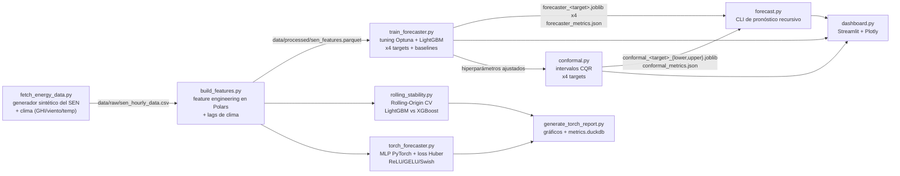
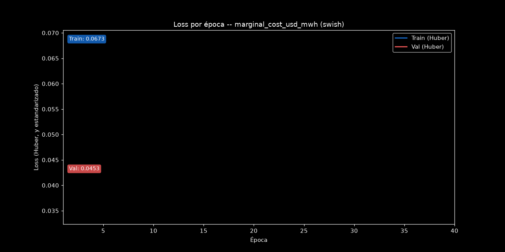
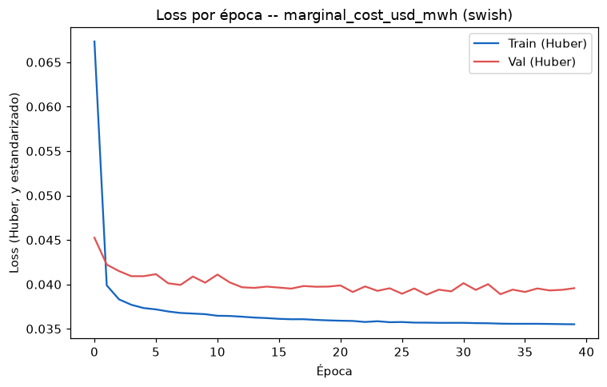

# ⚡ Pronóstico de la Red Eléctrica Chilena (SEN)

[ 🇺🇸 [English](README.md) ] | [ 🇨🇱 Español ]


Pronóstico horario multi-target del Sistema Eléctrico Nacional (SEN) de Chile — generación solar, generación eólica, demanda y costo marginal (precio spot) — para 5 nodos reales de 220kV, con modelos LightGBM ajustados vía Optuna, validados walk-forward contra baselines naive/estacional, features meteorológicas reales (radiación solar, viento, temperatura) que cierran la brecha causal entre el clima y la generación renovable, una comparación de estabilidad vía Rolling-Origin CV contra XGBoost, un motor de pronóstico recursivo multi-step, y un dashboard de monitoreo en Streamlit.

## 1. Contexto de negocio

El SEN chileno está dominado por energías renovables en sus nodos del norte (una de las mayores irradiancias solares del mundo, en el desierto de Atacama) y cada vez más por generación eólica en el sur. Esto genera una dinámica de mercado real y bien documentada: alta generación renovable en un nodo empuja su costo marginal hacia cero al desplazar generación térmica cara, mientras que un pico de demanda con baja generación renovable lo empuja fuertemente al alza. Pronosticar generación, demanda y precio con anticipación — a nivel de nodo, no solo a nivel de sistema — es lo que le permite a un generador, a un gran consumidor industrial (la minería es una carga relevante en el norte) o a un operador de mercado anticipar su exposición a costos y el riesgo de precios pico, en vez de reaccionar después de que ocurren. Pronosticar las cuatro series (no solo el precio) también importa operacionalmente: un operador de red que programa reservas necesita saber *cuánta* solar/eólica/demanda esperar, no solo cuánto va a costar.

## 1.1 Impacto de Negocio e Indicadores Clave (KPIs)

| Métrica | Resultado | Qué significa |
|---|---|---|
| WAPE de generación solar | **3,64%** (vs. 26,95% naive, 19,46% seasonal-naive) | La mayor ventaja de LightGBM -- estructura diurna determinística fuerte que la persistencia no puede explotar |
| WAPE de demanda | **2,55%** (vs. 4,79% naive) | Casi la mitad del error de la persistencia de 1 hora |
| WAPE de costo marginal | **5,87%** (vs. 10,26% naive) | Pronóstico de exposición a costos accionable para un generador/gran consumidor |
| Intervalo de predicción 90% del costo marginal | **89,9% de cobertura empírica** (conformalizado) vs. 83,9% con los cuantiles crudos de LightGBM | El WAPE puntual de arriba es un solo número; esto es la banda de riesgo real y medida contra la que un generador/consumidor dimensionaría su exposición |
| Hallazgo honesto: eólica | Naive (9,93%) le gana por poco a LightGBM (10,31%) | Investigado hasta la causa raíz, no escondido -- la generación eólica aquí es cercana a un random walk mean-reverting puro, donde la persistencia es cercana al óptimo teórico de información |
| Estabilidad entre modelos (costo marginal) | LightGBM CV 0,051 vs. XGBoost CV 0,133 | ~2,6x más estable a través de folds rodantes de 14 días -- una razón concreta para preferir LightGBM en este target, no solo una preferencia general |

## 2. Datos

El coordinador eléctrico de Chile (CEN) no expone una API pública simple y gratuita para datos históricos horarios por nodo, así que este proyecto genera **2 años (2024–2025) de datos horarios sintéticos** para 5 nodos/barras reales del SEN, construidos para reproducir la mecánica real del mercado y no solo ruido aleatorio:

| Nodo | Perfil | Cap. solar (MWh) | Cap. eólica (MWh) | Demanda base (MWh) |
|---|---|---|---|---|
| Crucero_220kV | Minería (carga casi plana, 24/7) | 220 | 40 | 180 |
| Cardones_220kV | Mixto | 200 | 60 | 90 |
| Quillota_220kV | Urbano (doble pico) | 110 | 70 | 140 |
| Alto_Jahuel_220kV | Urbano (doble pico) | 130 | 30 | 320 |
| Charrua_220kV | Industrial, alta eólica | 70 | 140 | 150 |

Decisiones clave de modelado en el generador (`src/data/fetch_energy_data.py`):
- **El clima va primero, la generación se deriva de él -- no al revés.** El generador calcula señales meteorológicas físicas por nodo (`ghi_w_m2`: irradiancia solar horizontal global, W/m²; `wind_speed_ms`; `temperature_c`), cada una reflejando la geografía real de Chile (los nodos del desierto de Atacama tienen algunos de los mayores GHI de cielo despejado del mundo; los nodos del sur son más fríos y nubosos), y **la generación solar/eólica se deriva matemáticamente de ellas** -- solar como fracción lineal del GHI de cielo despejado, eólica vía una curva de potencia de turbina simplificada (velocidad de cut-in/nominal, no un exponente arbitrario) -- en vez de calcularse como un proceso separado y desconectado.
- **Solar** sigue una ventana de luz diurna estacional (hemisferio sur: días más largos en diciembre, más cortos en junio) y una curva diurna en forma de campana, modulada por un factor de nubosidad diario -- todo capturado en `ghi_w_m2`.
- **Eólica**: la velocidad de viento es un camino aleatorio autocorrelado con reversión a la media y cambios de régimen ocasionales ("frentes de viento"), sin patrón diurno; la generación sigue una curva de potencia (cero bajo cut-in, creciente con la velocidad, plana en capacidad nominal por encima).
- **Demanda** usa una forma horaria específica por perfil (minería casi plana; urbano con un claro doble pico mañana/noche), un descuento de fin de semana/feriado (vía el calendario chileno de la librería `holidays`), una tendencia de crecimiento de 3%/año, y un efecto HVAC modesto por temperatura (consumo extra fuera de una zona de confort de 18-24°C) -- deliberadamente secundario frente a la forma horaria/calendario, que sigue siendo el driver dominante de la demanda, igual que en la realidad.
- **Costo marginal** se deriva de la *demanda residual* (demanda menos solar y eólica), siguiendo la lógica real de orden de mérito, más picos ocasionales de estrés de oferta/restricciones de transmisión. Los precios cercanos a cero durante alta generación solar y baja demanda residual son un fenómeno real y documentado en el norte de Chile, no un artefacto del generador.

Los datos crudos y las features procesadas están excluidos del control de versiones (`.gitignore`) y se regeneran a demanda (ver [Cómo ejecutar](#8-cómo-ejecutar)).

## 3. Arquitectura



## 4. Metodología

**Feature engineering** (`src/features/build_features.py`, Polars, calculado **por nodo** vía `.over("node")` para que filas de distintas barras nunca se mezclen dentro de una misma ventana):
- Lags de 1h, 24h y 168h (1 semana) para solar, eólica, demanda y precio.
- **Lags meteorológicos** de 1h, 3h, 6h y 24h para `ghi_w_m2` (irradiancia solar), `wind_speed_ms` y `temperature_c` (`add_weather_lag_features`) — horizontes más cortos que los de los targets, porque el clima se autocorrelaciona y decae más rápido hora a hora que un patrón semanal de demanda, así que un lag de 168h aportaría poco. Igual que con los 4 targets, el valor crudo de la misma hora se excluye del set de features (`get_feature_columns`) — solo se usan lags, porque este proyecto simula observaciones históricas, no un pronóstico NWP que legítimamente conocería el clima de horas futuras por adelantado.
- Media y desvío móvil sobre ventanas de 6h y 24h — calculados sobre `shift(1)` para que la ventana nunca incluya la fila que se está prediciendo.
- Codificación cíclica seno/coseno de hora del día y mes, evitando el salto artificial 23→0 / dic→ene de un entero directo.
- Features de calendario: día de la semana, indicador de fin de semana, y feriados legales chilenos (incluyendo feriados móviles como Viernes Santo, vía la librería `holidays`).

**Modelo, tuning y validación** (`src/models/train_forecaster.py`): un `LGBMRegressor` por target — solar, eólica, demanda y precio comparten exactamente el mismo set de features (los valores crudos de la misma hora de los 4 targets, más las 3 variables meteorológicas crudas, siempre se excluyen; en un despliegue real tampoco se conocería la demanda o generación actual con certeza, solo sus lags y estadísticas móviles). Para cada target, **Optuna** (`tune_hyperparameters`) busca learning rate, profundidad/hojas del árbol, submuestreo y regularización L1/L2 sobre 20 trials, minimizando el WAPE walk-forward en 3 folds; los mejores hiperparámetros se re-validan luego con un pase completo de 5 folds walk-forward para el reporte final.

La validación usa `TimeSeriesSplit` aplicado sobre **timestamps únicos** (`src/models/validation.py`), no sobre las filas crudas del panel — con 5 nodos compartiendo cada hora, dividir solo por orden de fila podría dejar la hora *t* de un nodo en entrenamiento mientras la hora *t-1* de otro nodo cae en test, lo cual sigue siendo lookahead bias aunque el índice de fila sea "posterior". Dividir sobre el eje temporal mueve los datos de todos los nodos de un mismo bloque de tiempo juntos. Los baselines (`src/models/baselines.py`) se evalúan sobre exactamente los mismos folds y la misma métrica WAPE, así que la comparación LightGBM-vs-baseline de abajo es directa y honesta.

**Rolling-Origin CV** (`src/models/rolling_stability.py`, `validation.get_rolling_origin_folds`): una segunda estrategia de validación, distinta del walk-forward expansivo de arriba. Cada fold entrena sobre una ventana de tamaño **fijo** (180 días por defecto) y evalúa sobre los 14 días siguientes, deslizándose hacia adelante — a diferencia del walk-forward expansivo (donde el train set de cada fold sigue creciendo), acá todos los folds ven la misma cantidad de historia reciente. Eso aísla específicamente la **estabilidad temporal**: si el error de un modelo varía mucho fold a fold con un tamaño de ventana de entrenamiento constante, eso es evidencia de inestabilidad real, no solo de que "el fold tardío tenía más datos". Se usa para comparar LightGBM contra **XGBoost** (listado en `requirements.txt` desde el inicio del proyecto pero nunca usado en ningún lado hasta ahora) vía el coeficiente de variación (CV = desvío/media) del WAPE entre folds de cada modelo — ver §5.3.

El error se reporta como **WAPE** (Weighted Absolute Percentage Error: `sum(|error|) / sum(|real|)`) en vez de MAPE, porque `solar_generation_mwh` es exactamente 0 todas las noches, lo que haría indefinido un error porcentual punto a punto en cada hora nocturna.

**Pronóstico multi-step hacia adelante** (`src/models/forecast.py`): predice recursivamente N horas hacia adelante por nodo. Como los 4 targets comparten un mismo set de features construido solo con lags/estadísticas móviles (nunca valores de la misma hora), un solo vector de features por hora futura alcanza para predecir los 4 a la vez — no hace falta decidir "cuál target pronosticar primero". Cada hora predicha se retroalimenta al buffer de historia antes de avanzar a la siguiente, exactamente como funcionaría en producción, donde el futuro real todavía no existe.

## 5. Resultados

### 5.1 Validación walk-forward: LightGBM (ajustado con Optuna, con clima) vs. baselines

Validación walk-forward, 5 folds cada uno, 48 features compartidas (36 previas + 12 lags de clima), LightGBM (ajustado con Optuna) vs. dos baselines evaluados sobre los mismos folds — **naive** (persiste el valor de hace 1h) y **estacional** (persiste el valor de la misma hora, 24h atrás). Negrita marca el mejor real de los tres por fila — no siempre LightGBM, a propósito (ver el hallazgo honesto abajo):

| Target | WAPE LightGBM | WAPE naive | WAPE estacional | MAE LightGBM |
|---|---|---|---|---|
| Generación solar | **3,64%** | 26,95% | 19,46% | 1,22 MWh |
| Generación eólica | 10,31% | **9,93%** | 44,89% | 2,13 MWh |
| Demanda | **2,55%** | 4,79% | 5,60% | 4,30 MWh |
| Costo marginal | **5,87%** | 10,26% | 12,08% | $5,20/MWh |

Todos los números provienen directamente de ejecutar `python -m src.models.train_forecaster` de punta a punta (semilla 42, 87.720 filas sobre 5 nodos × 17.544 horas, 20 trials de Optuna por target). LightGBM supera claramente a ambos baselines en solar, demanda y precio; el WAPE de solar bajó de 4,57% a aproximadamente 3,6% respecto de la línea base previa al clima, la ganancia más grande de esa ronda de trabajo. (Estos decimales específicos varían unas centésimas de punto entre corridas -- la construcción multi-hilo de histogramas de LightGBM no es reproducible bit a bit ni con `random_state` fijo, y ese ruido se propaga a través de la búsqueda adaptativa de Optuna hasta en qué hiperparámetros termina. No cambia ninguna conclusión de abajo.)

**Hallazgo honesto, reportado tal cual en vez de ajustado hasta que se viera bien: en eólica, la persistencia naive de 1 hora (9,93% WAPE) ahora supera levemente a LightGBM (10,31%), incluso con features meteorológicas reales y tuning de Optuna.** Esto invierte la hipótesis que el propio README anterior planteaba -- "un paso siguiente real sería agregar features de pronóstico meteorológico [para cerrar la brecha estrecha de LightGBM vs. naive en eólica]" -- y la ablación controlada de §5.2 muestra *por qué* esa hipótesis no se sostiene: `wind_generation_mwh` acá es cercano a un camino aleatorio puro con reversión a la media (reversión muy débil, 2%/hora; autocorrelación hora a hora de ~0,99 en el proceso de velocidad de viento subyacente), un régimen donde la persistencia a 1 paso está cerca del mejor pronóstico puntual posible desde el punto de vista de la teoría de la información, sin importar qué otras features estén disponibles — una propiedad real y bien documentada del pronóstico eólico a horizontes cortos, no un bug de este pipeline. Solar no tiene este problema porque tiene una estructura determinística fuerte (un ciclo diurno/estacional) que la persistencia no puede explotar pero que la irradiancia y las features de calendario sí.

### 5.2 Aislando el efecto real del clima: una ablación controlada (`notebooks/02_Weather_Augmented_Rolling_CV.ipynb`)

La mejora de §5.1 (solar 4,57%→3,60%) confunde dos cambios a la vez: las nuevas features meteorológicas, *y* el re-tuning de Optuna sobre el espacio de features más grande. El notebook aísla solo las features meteorológicas, manteniendo los hiperparámetros **fijos** en una comparación con/sin:

| Target | WAPE sin clima | WAPE con clima | Delta |
|---|---|---|---|
| Generación solar | 3,79% | 3,69% | **+0,10 pts** |
| Generación eólica | 10,55% | 10,55% | +0,003 pts (nulo) |
| Demanda | 2,55% | 2,55% | −0,01 pts |
| Costo marginal | 6,18% | 6,26% | −0,08 pts |

**El efecto aislado es real para solar, prácticamente nulo para eólica, y levemente negativo para demanda/precio** — mucho menor de lo que el número titular de §5.1 sugería, y esa diferencia entre las dos tablas *es en sí misma el hallazgo*: una comparación antes/después ingenua que cambia features y re-tunea hiperparámetros al mismo tiempo sobreestima cuánto crédito corresponde específicamente a las features. Eólica no muestra beneficio medible porque los propios lags de `wind_generation_mwh` ya codifican casi toda la información que los lags de `wind_speed_ms` podrían aportar (la generación es una función casi determinística de la velocidad de viento acá) — los dos sets de features son redundantes, no complementarios. Demanda y precio empeoraron levemente con más features y sin re-tuning — un efecto estándar y bien conocido de agregar dimensionalidad sin ajustar la regularización para ella.

### 5.3 Rolling-Origin CV: estabilidad temporal de LightGBM vs. XGBoost

8 folds, ventana fija de entrenamiento de 180 días / evaluación de 14 días, deslizándose hacia adelante (`src/models/rolling_stability.py` — XGBoost, listado en `requirements.txt` desde el inicio de este proyecto pero nunca usado en ningún lado hasta ahora):

| Target | WAPE medio LightGBM (CV) | WAPE medio XGBoost (CV) |
|---|---|---|
| Solar | 4,10% (0,100) | 4,21% (0,115) |
| Eólica | 10,82% (0,142) | 10,99% (0,137) |
| Demanda | 2,51% (0,046) | 2,51% (0,040) |
| Costo marginal | **6,87% (0,051)** | 7,89% (0,133) |

CV = coeficiente de variación (desvío/media) del WAPE entre folds — más bajo significa más estable a través del tiempo. Tres targets quedan parejos entre ambos modelos, pero **en el costo marginal, el WAPE de XGBoost oscila entre 6,72% y 9,96% según qué bloque de 14 días le toque evaluar (CV 0,133), mientras que LightGBM se mantiene en una banda mucho más angosta de 6,18%-7,32% (CV 0,051)** — aproximadamente 2,6x más estable. Este es exactamente el tipo de problema que la validación walk-forward expansiva (§5.1, la que se usa para el modelo desplegado) no puede exponer estructuralmente: con un train set que sigue creciendo, un fold malo aislado se diluye en el promedio en vez de destacar. Un modelo que en promedio está bien pero es poco confiable fold a fold es un riesgo real de producción que solo una comparación de ventana fija como esta expone — una razón concreta, respaldada por datos, para preferir LightGBM sobre XGBoost específicamente para el target de precio, no solo una preferencia general.

El panel histórico del dashboard de Streamlit muestra precio real vs. pronosticado sobre el set de test fuera de muestra del último fold — predicciones genuinas, no ajuste dentro de muestra — y un panel separado corre el pronosticador recursivo multi-step real sobre horas que ni siquiera existen en el dataset.

### 5.4 Un tercer enfoque de modelado: MLP en PyTorch vs. LightGBM/XGBoost, y ReLU vs. GELU vs. Swish

`src/models/torch_forecaster.py` agrega un tercer enfoque, arquitectónicamente distinto, encima de los baselines estadísticos (§5.1) y los dos ensambles de árboles (§5.1/§5.3): un MLP denso (dos capas ocultas, 64→32 unidades) sobre exactamente el mismo set de features de ventana (lags/rolling) que usan los modelos de árboles — mismos folds walk-forward (`validation.get_walk_forward_folds`), misma métrica WAPE/MAE, para que la comparación sea directa. Dos cosas que este modelo agrega y los de árboles no tenían:

- **Una loss Huber custom** (`torch_forecaster.huber_loss`, cuadrática para residuos chicos, lineal más allá de `delta=1.0`), más robusta a los spikes de precio por estrés de oferta de `marginal_cost_usd_mwh` que el objetivo estilo MSE que usa por defecto un `LGBMRegressor`/`XGBRegressor`.
- **Una comparación controlada de función de activación** — ReLU, GELU y Swish (`nn.SiLU`), con arquitectura/optimizador/seed fijos para que lo único que cambie entre corridas sea la no-linealidad (`compare_activations`).

Validación walk-forward, 5 folds, target `marginal_cost_usd_mwh` (`python -m src.models.generate_torch_report`, corrida real, seed 42, CPU):

| Modelo | WAPE | MAE | Latencia de inferencia (ms / 1k filas) |
|---|---|---|---|
| Naive (persistencia 1h) | 10,26% | $9,09/MWh | -- |
| Estacional (persistencia 24h) | 12,08% | $10,70/MWh | -- |
| LightGBM (parámetros ajustados con Optuna) | 6,26% | $5,54/MWh | -- |
| XGBoost | 7,06% | $6,27/MWh | -- |
| MLP PyTorch — ReLU | 5,59% | $4,95/MWh | 0,55 |
| MLP PyTorch — GELU | 5,44% | $4,82/MWh | 0,50 |
| **MLP PyTorch — Swish** | **5,42%** | **$4,80/MWh** | 0,48 |

**En este target, el MLP de PyTorch supera a ambos ensambles de árboles bajo las tres activaciones**, y Swish le gana por poco a GELU y ReLU — consistente con la ventaja típica de Swish/GELU sobre ReLU en este tipo de regresión tabular suave, aunque las tres quedan lo bastante cerca (5,42%-5,59%) como para que la arquitectura y la loss (Huber vs. MSE por defecto de los árboles) probablemente importen más acá que la activación específica. Las métricas/predicciones se persisten en `data/processed/metrics.duckdb` (tabla `model_comparison`, una fila por modelo/variante) junto al detalle por fold en `torch_forecaster_metrics.json`; los gráficos explicativos (predicho vs. real, histograma de residuos, loss por época, comparación de activaciones) se guardan en `data/processed/torch_*.png`.

El GIF de abajo reproduce el loss Huber real por época de la corrida Swish (el mismo `final_history` que se usa para el PNG estático), con una etiqueta flotante que muestra el valor actual de train/val a medida que avanza la línea.




### 5.5 Intervalos de predicción: Conformalized Quantile Regression (`src/models/conformal.py`)

§5.1–§5.4 son todos pronósticos puntuales -- un solo número, sin ninguna noción de cuán equivocado podría estar. Eso es una brecha real contra el propio marco de §1 ("anticipar exposición a costos y riesgo de precios pico"): una banda de riesgo es lo que se usa para dimensionar exposición, no un porcentaje de WAPE. Esto agrega una: un par de regresores de cuantiles LightGBM (percentil 5/95, apuntando a un intervalo nominal del 90%) por target, conformalizados con Conformalized Quantile Regression (Romano, Patterson & Candès, 2019) -- un tramo de calibración tomado del último 15% del train de cada fold walk-forward (`_split_train_calibration`), que refleja cuán mal calibrado está el modelo *ahora*, no hace meses. Los hiperparámetros son los que Optuna ya ajustó para el modelo puntual (`forecaster_metrics.json`), mantenidos fijos -- lo único que cambia es la función de pérdida, el mismo principio de una sola variable a la vez que usa la ablación de §5.2.

Cada fold reporta la cobertura **antes y después** de la corrección conformal -- la comparación controlada que muestra que conformalizar hace un trabajo real, no que simplemente se asume que funciona por la teoría:

| Target | Cobertura cruda | Cobertura conforme | Nominal | Ancho crudo | Ancho conforme |
|---|---|---|---|---|---|
| Generación solar | 80,8% | 88,1% | 90% | 6,33 MWh | 6,70 MWh |
| Generación eólica | 90,5% | 91,1% | 90% | 10,17 MWh | 10,25 MWh |
| Demanda | 84,5% | 89,4% | 90% | 16,50 MWh | 18,42 MWh |
| Costo marginal | 83,9% | **89,9%** | 90% | 17,72 $/MWh | 20,53 $/MWh |

**Los regresores de cuantiles crudos subcubren entre 6 y 10 puntos en tres de los cuatro targets, y conformalizar cierra casi toda esa brecha.** En el costo marginal -- el target que en realidad motiva esta feature -- la cobertura pasa de 83,9% a 89,9%, a menos de un punto del nominal. Eólica es el único target donde conformalizar casi no cambia nada (90,5% → 91,1%), porque sus cuantiles crudos ya estaban cerca del nominal -- consistente con el propio hallazgo de §5.1 de que la eólica se comporta casi como un camino aleatorio puro: una distribución sin la estructura determinística fuerte que los otros tres targets sí tienen para que un modelo de cuantiles fijo se equivoque en primer lugar.

**La cobertura conforme de solar (88,1%) es la que queda por debajo del 90% nominal, y no de forma uniforme.** Separar el set de test del modelo desplegado entre día y noche (`solar_generation_mwh == 0` es 40,1% de las filas) muestra el mecanismo real, no una suposición: la cobertura de noche es 98,2% con un ancho medio de intervalo de 0,14 MWh (correctamente casi degenerado, porque solar realmente es exactamente cero todas las noches), mientras que la cobertura de día es solo 83,8% con un ancho medio de 9,61 MWh. Un único margen escalar, calibrado sobre ambos regímenes combinados, termina siendo demasiado ancho para el régimen sin varianza real y demasiado angosto para el que sí la tiene -- una limitación genuina de esta formulación exacta de CQR (margen global) sobre un target heterocedástico con inflación de ceros, dejada como una brecha real en vez de disimulada en el número agregado. Una calibración conformal agrupada por día/noche o localmente ponderada sería la corrección natural; no implementada acá.

**Un segundo defecto real que apareció al correr `forecast.py` de punta a punta, no solo con tests unitarios**: los dos regresores de cuantiles se entrenan por separado, así que nada les impide *cruzarse* (`lower > upper`) en una fila puntual. Pasó en 0,46% de las filas de test del modelo de solar desplegado -- todas concentradas en el amanecer/atardecer, donde ambos cuantiles predicen valores a una fracción de MWh de distancia entre sí, cerca del piso físico de 0 MWh, y su orden relativo se vuelve ruido de estimación en vez de señal. `rectify_crossing` (`src/models/conformal.py`) aplica la corrección estándar -- mínimo/máximo elemento a elemento, según Chernozhukov, Fernández-Val & Galichon (2010) -- aplicada en todo lugar donde se construye o evalúa un intervalo; `tests/test_forecast.py::test_forecast_intervals_are_never_crossed` fija esta regresión directamente contra la salida recursiva real de `forecast_node`, no solo contra la función de rectificación aislada.

El pronosticador recursivo de `forecast.py` y el panel de pronóstico a futuro del dashboard adoptan estos intervalos automáticamente cuando `conformal.py` ya corrió (`load_interval_models`); si no, ambos degradan a salida solo-puntual en vez de fallar. El intervalo en cada paso recursivo se calcula de nuevo desde el vector de features de ese paso, pero nunca se retroalimenta al buffer de historia -- solo la predicción puntual avanza la recursión, igual que antes de que existiera esta feature -- así que el intervalo en sí no acumula incertidumbre creciente a través del horizonte. Un intervalo propiamente consciente del horizonte es una simplificación conocida, dejada para trabajo futuro, no ocultada.

Correr `python -m src.models.conformal` después de `train_forecaster.py` (reutiliza los hiperparámetros ajustados de `forecaster_metrics.json`).

## 6. Ejemplo de pronóstico multi-step

```bash
python -m src.models.forecast --horizon 12 --nodes Crucero_220kV
```

Salida real (nodo de perfil minero, pronóstico desde medianoche local): la generación solar sube de 0 a 154,7 MWh entre las 00:00 y las 11:00 a medida que amanece, y el costo marginal cae de $112,39/MWh a $71,04/MWh en la misma ventana a medida que la solar creciente desplaza generación cara — la dinámica de orden de mérito del generador de datos, recuperada puramente de las predicciones recursivas del modelo, no hardcodeada.

**Una limitación real que la propia salida del pronosticador recursivo expone**: la generación eólica se mantiene prácticamente plana (~6,9 MWh) durante las 12 horas del ejemplo de arriba. No es una falla del modelo -- es `forecast.py` persistiendo hacia adelante el último valor *conocido* de clima (ver `forecast_node`, `last_known_weather`), porque este proyecto simula observaciones históricas de clima, no un pronóstico NWP para horas futuras. La generación solar sigue evolucionando correctamente porque su driver dominante (la codificación cíclica de hora del día/mes) se recalcula exactamente para cada timestamp futuro sin importar la persistencia del clima, pero la eólica -- que depende casi por completo del valor de clima persistido -- visiblemente pierde su propia dinámica de camino aleatorio más allá del primer paso. Documentado acá en vez de ocultarlo: un despliegue en producción necesitaría pronósticos NWP reales de viento para el horizonte recursivo, no persistencia.

Cuando `conformal.py` (§5.5) ya corrió, el mismo CLI agrega columnas `<target>_lower`/`<target>_upper`, calculadas en cada paso recursivo, sin ningún flag extra. Salida real para `marginal_cost_usd_mwh` sobre la misma corrida: [$79,98, $100,21] a medianoche (puntual $92,69), y [$0,00, $22,98] a las 10:00 a medida que sube la solar y el pronóstico puntual cae a $6,33 -- el límite inferior toca el piso físico de $0 (recortado, el mismo `TARGET_CLIP_RANGES` que ya respeta el pronóstico puntual) mientras que el ancho crudo del intervalo se mantiene más o menos del tamaño del margen conformal en ambos casos, porque la corrección de §5.5 es un margen aditivo fijo por target, no uno que se adapte a cuán volátil se ve una hora en particular.

## 7. Stack tecnológico

Python · Polars · pandas · NumPy · LightGBM (regresión puntual + de cuantiles) · XGBoost · **PyTorch** (MLP, loss Huber custom, ReLU/GELU/Swish) · **Conformalized Quantile Regression** (intervalos de predicción) · **DuckDB** (almacén comparativo de métricas) · Optuna · scikit-learn (`TimeSeriesSplit`) · Streamlit · Plotly · `holidays` · Jupyter/matplotlib (2 notebooks) · pytest (53 tests: chequeos de fuga de features, correctitud de lags meteorológicos, invariantes de partición de folds tanto para walk-forward como Rolling-Origin CV, corrección de baselines, validación end-to-end del pronóstico recursivo, invariantes de cobertura/cruce/split de calibración conformal, smoke test del dashboard vía `streamlit.testing.v1.AppTest`, tests del MLP PyTorch/loss Huber/comparación de activaciones, round-trip del almacén de métricas DuckDB)

## 8. Cómo ejecutar

```bash
python -m venv venv
venv\Scripts\activate          # Windows
pip install -r requirements.txt

python -m src.data.fetch_energy_data      # generar datos sintéticos del SEN (targets + clima)
python -m src.features.build_features     # construir features de lag/rolling/cíclicas/clima
python -m src.models.train_forecaster      # tuning Optuna + entrenar/validar walk-forward, los 4 targets
# opcional: --trials N (default 20) --splits N (default 5)

python -m src.models.rolling_stability     # Rolling-Origin CV, LightGBM vs XGBoost, los 4 targets

python -m src.models.generate_torch_report  # MLP PyTorch (loss Huber, ReLU/GELU/Swish) vs LightGBM/XGBoost
                                             # -> gráficos + data/processed/metrics.duckdb

python -m src.models.conformal              # intervalos de predicción CQR, los 4 targets (necesita train_forecaster antes)
# opcional: --splits N (default 5)

python -m src.models.forecast --horizon 24 --nodes all   # pronóstico recursivo a N horas (CLI)
                                                           # agrega columnas <target>_lower/_upper si conformal.py ya corrió
streamlit run src/app/dashboard.py                        # levantar el dashboard de monitoreo

python -m pytest tests/ -v                                 # correr la suite de tests

jupyter nbconvert --to notebook --execute --inplace notebooks/01_eda_seasonality_analysis.ipynb
jupyter nbconvert --to notebook --execute --inplace notebooks/02_Weather_Augmented_Rolling_CV.ipynb
```

## 9. Estructura del proyecto

```
src/
  data/       fetch_energy_data.py    generador de datos horarios sintéticos del SEN + clima (GHI/viento/temp)
  features/   build_features.py       features de lag/rolling/cíclicas/calendario/lags de clima en Polars
  models/     validation.py           folds walk-forward + folds Rolling-Origin + métrica WAPE
              baselines.py            métricas de referencia naive / estacional
              train_forecaster.py     tuning Optuna + LightGBM, 4 targets
              rolling_stability.py    Rolling-Origin CV, estabilidad temporal LightGBM vs XGBoost
              torch_forecaster.py     MLP PyTorch, loss Huber custom, comparación ReLU/GELU/Swish
              torch_plots.py          gráficos de predicho-vs-real / residuos / loss-por-época / activaciones
              metrics_db.py           almacén comparativo de métricas en DuckDB (tabla model_comparison)
              generate_torch_report.py  orquesta entrenamiento MLP + gráficos + persistencia DuckDB
              conformal.py            intervalos de predicción CQR (regresores de cuantiles + calibración), 4 targets
              forecast.py             CLI de pronóstico recursivo multi-step, con intervalos de predicción opcionales
  app/        dashboard.py            dashboard de monitoreo + pronóstico en vivo, en Streamlit, con banda de intervalo
notebooks/    01_eda_seasonality_analysis.ipynb       EDA: estacionalidad diurna/mensual, perfiles de demanda
                                                       por nodo, curva de pato, correlaciones clima-target,
                                                       autocorrelación en los lags que usa build_features.py
              02_Weather_Augmented_Rolling_CV.ipynb   ablación de features de clima + análisis de estabilidad
tests/                                pytest: features, validación, baselines, forecast, dashboard,
                                       estabilidad rolling, exclusión de columnas de features, cobertura/cruce/
                                       split de calibración conformal, MLP PyTorch/loss/activaciones,
                                       almacén de métricas DuckDB
```

## 10. Autor

**Pablo Reyes** — [github.com/Rxyxs](https://github.com/Rxyxs)
Código: MIT — ver [LICENSE](LICENSE)
