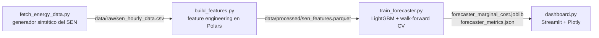

# ⚡ Pronóstico de la Red Eléctrica Chilena (SEN)

[ 🇺🇸 [English](README.md) ] | [ 🇨🇱 Español ]


Pronóstico horario del costo marginal (precio spot) del Sistema Eléctrico Nacional (SEN) de Chile, para 5 nodos reales de 220kV — generación solar/eólica, demanda y precio — con un modelo LightGBM validado walk-forward y un dashboard de monitoreo en Streamlit.

## 1. Contexto de negocio

El SEN chileno está dominado por energías renovables en sus nodos del norte (una de las mayores irradiancias solares del mundo, en el desierto de Atacama) y cada vez más por generación eólica en el sur. Esto genera una dinámica de mercado real y bien documentada: alta generación renovable en un nodo empuja su costo marginal hacia cero al desplazar generación térmica cara, mientras que un pico de demanda con baja generación renovable lo empuja fuertemente al alza. Pronosticar ese precio con anticipación — a nivel de nodo, no solo a nivel de sistema — es lo que le permite a un generador, a un gran consumidor industrial (la minería es una carga relevante en el norte) o a un operador de mercado anticipar su exposición a costos y el riesgo de precios pico, en vez de reaccionar después de que ocurren.

## 2. Datos

El coordinador eléctrico de Chile (CEN) no expone una API pública simple y gratuita para datos históricos horarios por nodo, así que este proyecto genera **2 años (2024–2025) de datos horarios sintéticos** para 5 nodos/barras reales del SEN, construidos para reproducir la mecánica real del mercado y no solo ruido aleatorio:

| Nodo | Perfil | Cap. solar (MWh) | Cap. eólica (MWh) | Demanda base (MWh) |
|---|---|---|---|---|
| Crucero_220kV | Minería (carga casi plana, 24/7) | 220 | 40 | 180 |
| Cardones_220kV | Mixto | 200 | 60 | 90 |
| Quillota_220kV | Urbano (doble pico) | 110 | 70 | 140 |
| Alto_Jahuel_220kV | Urbano (doble pico) | 130 | 30 | 320 |
| Charrua_220kV | Industrial, alta eólica | 70 | 140 | 150 |

Decisiones clave de modelado en el generador (`src/data/fetch_energy_data.py`):
- **Solar** sigue una ventana de luz diurna estacional (hemisferio sur: días más largos en diciembre, más cortos en junio) y una curva diurna en forma de campana, modulada por un factor de nubosidad diario.
- **Eólica** es un camino aleatorio autocorrelado con reversión a la media y cambios de régimen ocasionales ("frentes de viento"), sin patrón diurno — reflejando cómo se comporta el viento respecto del solar.
- **Demanda** usa una forma horaria específica por perfil (minería casi plana; urbano con un claro doble pico mañana/noche), un descuento de fin de semana/feriado (vía el calendario chileno de la librería `holidays`) y una tendencia de crecimiento de 3%/año.
- **Costo marginal** se deriva de la *demanda residual* (demanda menos solar y eólica), siguiendo la lógica real de orden de mérito, más picos ocasionales de estrés de oferta/restricciones de transmisión. Los precios cercanos a cero durante alta generación solar y baja demanda residual son un fenómeno real y documentado en el norte de Chile, no un artefacto del generador.

Los datos crudos y las features procesadas están excluidos del control de versiones (`.gitignore`) y se regeneran a demanda (ver [Cómo ejecutar](#7-cómo-ejecutar)).

## 3. Arquitectura



## 4. Metodología

**Feature engineering** (`src/features/build_features.py`, Polars, calculado **por nodo** vía `.over("node")` para que filas de distintas barras nunca se mezclen dentro de una misma ventana):
- Lags de 1h, 24h y 168h (1 semana) para solar, eólica, demanda y precio.
- Media y desvío móvil sobre ventanas de 6h y 24h — calculados sobre `shift(1)` para que la ventana nunca incluya la fila que se está prediciendo.
- Codificación cíclica seno/coseno de hora del día y mes, evitando el salto artificial 23→0 / dic→ene de un entero directo.
- Features de calendario: día de la semana, indicador de fin de semana, y feriados legales chilenos (incluyendo feriados móviles como Viernes Santo, vía la librería `holidays`).

**Modelo y validación** (`src/models/train_forecaster.py`): un `LGBMRegressor` que predice `marginal_cost_usd_mwh`, validado con `TimeSeriesSplit` (5 folds) aplicado sobre **timestamps únicos** y no sobre las filas crudas del panel — con 5 nodos compartiendo cada hora, dividir solo por orden de fila podría dejar la hora *t* de un nodo en entrenamiento mientras la hora *t-1* de otro nodo cae en test, lo cual sigue siendo lookahead bias aunque el índice de fila sea "posterior". Dividir sobre el eje temporal mueve los datos de todos los nodos de un mismo bloque de tiempo juntos. Los valores crudos de la misma hora de las otras tres series (p. ej. `demand_mwh` al momento de predecir) se excluyen del set de features — en un despliegue real tampoco se conocería la demanda actual con certeza, solo sus lags y estadísticas móviles.

El error se reporta como **WAPE** (Weighted Absolute Percentage Error: `sum(|error|) / sum(|real|)`) en vez de MAPE, porque `solar_generation_mwh` es exactamente 0 todas las noches, lo que haría indefinido un error porcentual punto a punto en cada hora nocturna.

## 5. Resultados

Validación walk-forward, 5 folds, target `marginal_cost_usd_mwh`, 36 features:

| Fold | Filas train | Filas test | WAPE | MAE ($/MWh) |
|---|---|---|---|---|
| 0 | 14.480 | 14.480 | 6,36% | 5,93 |
| 1 | 28.960 | 14.480 | 6,55% | 5,49 |
| 2 | 43.440 | 14.480 | 5,99% | 5,22 |
| 3 | 57.920 | 14.480 | 5,34% | 5,11 |
| 4 | 72.400 | 14.480 | 6,00% | 5,17 |
| **Promedio** | | | **6,05%** | **5,38** |

Los números de arriba provienen directamente de ejecutar `python -m src.models.train_forecaster` de punta a punta (semilla 42, 87.720 filas generadas sobre 5 nodos × 17.544 horas). El dashboard de Streamlit (`src/app/dashboard.py`) muestra precio real vs. pronosticado sobre el set de test fuera de muestra del último fold — predicciones genuinas, no ajuste dentro de muestra, así que el dashboard refleja la misma precisión que un despliegue en producción podría esperar realmente.

## 6. Stack tecnológico

Python · Polars · pandas · NumPy · LightGBM · scikit-learn (`TimeSeriesSplit`) · Optuna (instalado, ciclo de tuning planificado) · Streamlit · Plotly · `holidays` · pytest

## 7. Cómo ejecutar

```bash
python -m venv venv
venv\Scripts\activate          # Windows
pip install -r requirements.txt

python -m src.data.fetch_energy_data      # generar datos sintéticos del SEN
python -m src.features.build_features     # construir features de lag/rolling/cíclicas
python -m src.models.train_forecaster     # entrenar + validar walk-forward

streamlit run src/app/dashboard.py        # levantar el dashboard de monitoreo
```

## 8. Estructura del proyecto

```
src/
  data/       fetch_energy_data.py    generador de datos horarios sintéticos del SEN
  features/   build_features.py       features de lag/rolling/cíclicas/calendario en Polars
  models/     train_forecaster.py     LightGBM + validación walk-forward
  app/        dashboard.py            dashboard de monitoreo de precios en Streamlit
```

## 9. Autor

**Pablo Reyes** — [github.com/Rxyxs](https://github.com/Rxyxs)
Código: MIT — ver [LICENSE](LICENSE)
