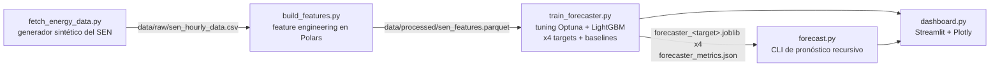

# ⚡ Pronóstico de la Red Eléctrica Chilena (SEN)

[ 🇺🇸 [English](README.md) ] | [ 🇨🇱 Español ]


Pronóstico horario multi-target del Sistema Eléctrico Nacional (SEN) de Chile — generación solar, generación eólica, demanda y costo marginal (precio spot) — para 5 nodos reales de 220kV, con modelos LightGBM ajustados vía Optuna, validados walk-forward contra baselines naive/estacional, un motor de pronóstico recursivo multi-step, y un dashboard de monitoreo en Streamlit.

## 1. Contexto de negocio

El SEN chileno está dominado por energías renovables en sus nodos del norte (una de las mayores irradiancias solares del mundo, en el desierto de Atacama) y cada vez más por generación eólica en el sur. Esto genera una dinámica de mercado real y bien documentada: alta generación renovable en un nodo empuja su costo marginal hacia cero al desplazar generación térmica cara, mientras que un pico de demanda con baja generación renovable lo empuja fuertemente al alza. Pronosticar generación, demanda y precio con anticipación — a nivel de nodo, no solo a nivel de sistema — es lo que le permite a un generador, a un gran consumidor industrial (la minería es una carga relevante en el norte) o a un operador de mercado anticipar su exposición a costos y el riesgo de precios pico, en vez de reaccionar después de que ocurren. Pronosticar las cuatro series (no solo el precio) también importa operacionalmente: un operador de red que programa reservas necesita saber *cuánta* solar/eólica/demanda esperar, no solo cuánto va a costar.

## 2. Datos

El coordinador eléctrico de Chile (CEN) no expone una API pública simple y gratuita para datos históricos horarios por nodo, así que este proyecto genera **2 años (2024–2025) de datos horarios sintéticos** para 5 nodos/barras reales del SEN, construidos para reproducir la mecánica real del mercado y no solo ruido aleatorio:

| Nodo | Perfil | Cap. solar (MWh) | Cap. eólica (MWh) | Demanda base (MWh) |
|---|---|---|---|---|
| Crucero_220kV | Minería (carga casi plana, 24/7) | 220 | 40 | 180 |
| Cardones_220kV | Mixto | 200 | 60 | 90 |
| Quillota_220kV | Urbano (doble pico) | 110 | 70 | 140 |
| Alto_Jahuel_220kV | Urbano (doble pico) | 130 | 30 | 320 |
| Charrua_220kV | Industrial, alta eólica | 70 | 140 | 150 |

Decisiones clave de modelado en el generador (`src/data/fetch_energy_data.py`):
- **Solar** sigue una ventana de luz diurna estacional (hemisferio sur: días más largos en diciembre, más cortos en junio) y una curva diurna en forma de campana, modulada por un factor de nubosidad diario.
- **Eólica** es un camino aleatorio autocorrelado con reversión a la media y cambios de régimen ocasionales ("frentes de viento"), sin patrón diurno — reflejando cómo se comporta el viento respecto del solar.
- **Demanda** usa una forma horaria específica por perfil (minería casi plana; urbano con un claro doble pico mañana/noche), un descuento de fin de semana/feriado (vía el calendario chileno de la librería `holidays`) y una tendencia de crecimiento de 3%/año.
- **Costo marginal** se deriva de la *demanda residual* (demanda menos solar y eólica), siguiendo la lógica real de orden de mérito, más picos ocasionales de estrés de oferta/restricciones de transmisión. Los precios cercanos a cero durante alta generación solar y baja demanda residual son un fenómeno real y documentado en el norte de Chile, no un artefacto del generador.

Los datos crudos y las features procesadas están excluidos del control de versiones (`.gitignore`) y se regeneran a demanda (ver [Cómo ejecutar](#8-cómo-ejecutar)).

## 3. Arquitectura



## 4. Metodología

**Feature engineering** (`src/features/build_features.py`, Polars, calculado **por nodo** vía `.over("node")` para que filas de distintas barras nunca se mezclen dentro de una misma ventana):
- Lags de 1h, 24h y 168h (1 semana) para solar, eólica, demanda y precio.
- Media y desvío móvil sobre ventanas de 6h y 24h — calculados sobre `shift(1)` para que la ventana nunca incluya la fila que se está prediciendo.
- Codificación cíclica seno/coseno de hora del día y mes, evitando el salto artificial 23→0 / dic→ene de un entero directo.
- Features de calendario: día de la semana, indicador de fin de semana, y feriados legales chilenos (incluyendo feriados móviles como Viernes Santo, vía la librería `holidays`).

**Modelo, tuning y validación** (`src/models/train_forecaster.py`): un `LGBMRegressor` por target — solar, eólica, demanda y precio comparten exactamente el mismo set de features (los valores crudos de la misma hora de los 4 targets siempre se excluyen, ver `get_feature_columns`; en un despliegue real tampoco se conocería la demanda o generación actual con certeza, solo sus lags y estadísticas móviles). Para cada target, **Optuna** (`tune_hyperparameters`) busca learning rate, profundidad/hojas del árbol, submuestreo y regularización L1/L2 sobre 20 trials, minimizando el WAPE walk-forward en 3 folds; los mejores hiperparámetros se re-validan luego con un pase completo de 5 folds walk-forward para el reporte final.

La validación usa `TimeSeriesSplit` aplicado sobre **timestamps únicos** (`src/models/validation.py`), no sobre las filas crudas del panel — con 5 nodos compartiendo cada hora, dividir solo por orden de fila podría dejar la hora *t* de un nodo en entrenamiento mientras la hora *t-1* de otro nodo cae en test, lo cual sigue siendo lookahead bias aunque el índice de fila sea "posterior". Dividir sobre el eje temporal mueve los datos de todos los nodos de un mismo bloque de tiempo juntos. Los baselines (`src/models/baselines.py`) se evalúan sobre exactamente los mismos folds y la misma métrica WAPE, así que la comparación LightGBM-vs-baseline de abajo es directa y honesta.

El error se reporta como **WAPE** (Weighted Absolute Percentage Error: `sum(|error|) / sum(|real|)`) en vez de MAPE, porque `solar_generation_mwh` es exactamente 0 todas las noches, lo que haría indefinido un error porcentual punto a punto en cada hora nocturna.

**Pronóstico multi-step hacia adelante** (`src/models/forecast.py`): predice recursivamente N horas hacia adelante por nodo. Como los 4 targets comparten un mismo set de features construido solo con lags/estadísticas móviles (nunca valores de la misma hora), un solo vector de features por hora futura alcanza para predecir los 4 a la vez — no hace falta decidir "cuál target pronosticar primero". Cada hora predicha se retroalimenta al buffer de historia antes de avanzar a la siguiente, exactamente como funcionaría en producción, donde el futuro real todavía no existe.

## 5. Resultados

Validación walk-forward, 5 folds cada uno, 36 features compartidas, LightGBM (ajustado con Optuna) vs. dos baselines evaluados sobre los mismos folds — **naive** (persiste el valor de hace 1h) y **estacional** (persiste el valor de la misma hora, 24h atrás):

| Target | WAPE LightGBM | WAPE naive | WAPE estacional | MAE LightGBM |
|---|---|---|---|---|
| Generación solar | **4,57%** | 27,02% | 19,68% | 1,22 MWh |
| Generación eólica | **10,51%** | 10,76% | 31,56% | 2,23 MWh |
| Demanda | **2,44%** | 4,98% | 5,54% | 3,98 MWh |
| Costo marginal | **5,76%** | 9,57% | 10,76% | $5,12/MWh |

Todos los números provienen directamente de ejecutar `python -m src.models.train_forecaster` de punta a punta (semilla 42, 87.720 filas sobre 5 nodos × 17.544 horas, 20 trials de Optuna por target). LightGBM supera claramente a ambos baselines en solar, demanda y precio.

**Hallazgo honesto que se mantiene en el reporte en vez de suavizarlo**: en eólica, LightGBM (10,51% WAPE) apenas supera a la persistencia simple (10,76%) — una ventaja de ~0,25 puntos, mucho menor que en los otros tres targets. Esto coincide con el propio diseño del generador: la eólica se modela como un camino aleatorio con reversión a la media y fuerte autocorrelación hora a hora, sin patrón diurno, así que "el viento dentro de una hora se parece al viento de ahora" ya es cercano al mejor predictor posible, y hay poca señal adicional en features de calendario/ciclicidad para que un modelo explote. Un paso siguiente real (documentado, no implementado acá) sería agregar features de pronóstico meteorológico (gradientes de presión regionales, observaciones de viento aguas arriba) en vez de esperar más ganancia de features puramente calendáricas.

El panel histórico del dashboard de Streamlit muestra precio real vs. pronosticado sobre el set de test fuera de muestra del último fold — predicciones genuinas, no ajuste dentro de muestra — y un panel separado corre el pronosticador recursivo multi-step real sobre horas que ni siquiera existen en el dataset.

## 6. Ejemplo de pronóstico multi-step

```bash
python -m src.models.forecast --horizon 12 --nodes Crucero_220kV
```

Salida real (nodo de perfil minero, pronóstico desde medianoche local): la generación solar sube de 0 a 175 MWh entre las 00:00 y las 11:00 a medida que amanece, y el costo marginal cae de $112/MWh a $51/MWh en la misma ventana a medida que la solar creciente desplaza generación cara — la dinámica de orden de mérito del generador de datos, recuperada puramente de las predicciones recursivas del modelo, no hardcodeada.

## 7. Stack tecnológico

Python · Polars · pandas · NumPy · LightGBM · Optuna · scikit-learn (`TimeSeriesSplit`) · Streamlit · Plotly · `holidays` · pytest (21 tests: chequeos de fuga de features, invariantes de partición de folds, corrección de baselines, validación end-to-end del pronóstico recursivo, smoke test del dashboard vía `streamlit.testing.v1.AppTest`)

## 8. Cómo ejecutar

```bash
python -m venv venv
venv\Scripts\activate          # Windows
pip install -r requirements.txt

python -m src.data.fetch_energy_data      # generar datos sintéticos del SEN
python -m src.features.build_features     # construir features de lag/rolling/cíclicas
python -m src.models.train_forecaster      # tuning Optuna + entrenar/validar walk-forward, los 4 targets
# opcional: --trials N (default 20) --splits N (default 5)

python -m src.models.forecast --horizon 24 --nodes all   # pronóstico recursivo a N horas (CLI)
streamlit run src/app/dashboard.py                        # levantar el dashboard de monitoreo

python -m pytest tests/ -v                                 # correr la suite de tests
```

## 9. Estructura del proyecto

```
src/
  data/       fetch_energy_data.py    generador de datos horarios sintéticos del SEN
  features/   build_features.py       features de lag/rolling/cíclicas/calendario en Polars
  models/     validation.py           folds walk-forward + métrica WAPE compartidos
              baselines.py            métricas de referencia naive / estacional
              train_forecaster.py     tuning Optuna + LightGBM, 4 targets
              forecast.py             CLI de pronóstico recursivo multi-step
  app/        dashboard.py            dashboard de monitoreo + pronóstico en vivo, en Streamlit
tests/                                pytest: features, validación, baselines, forecast, dashboard
```

## 10. Autor

**Pablo Reyes** — [github.com/Rxyxs](https://github.com/Rxyxs)
Código: MIT — ver [LICENSE](LICENSE)
