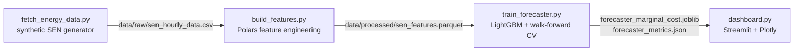

# ⚡ Chile Energy Grid Forecasting

[ 🇺🇸 English ] | [ 🇨🇱 [Español](README.es.md) ]


Hourly forecasting of the marginal cost (spot price) of Chile's National Electric System (SEN), for 5 real 220kV nodes across the grid — solar/wind generation, demand, and price — with a LightGBM model validated walk-forward and a Streamlit monitoring dashboard.

## 1. Business context

Chile's SEN is dominated by renewables in its northern nodes (some of the highest solar irradiance in the world, in the Atacama Desert) and increasingly by wind in the south. This creates a real, well-documented market dynamic: high renewable output at a node pushes its marginal cost toward zero by displacing expensive thermal generation, while a demand spike with low renewable output pushes it sharply upward. Forecasting that price ahead of time — at the node level, not just system-wide — is what lets a generator, a large industrial consumer (mining operations are a major load in the north), or a market operator anticipate cost exposure and price-spike risk instead of reacting to it after the fact.

## 2. Data

Chile's grid coordinator (CEN) does not expose a simple, free public API for historical hourly data by node, so this project generates **2 years (2024–2025) of synthetic hourly data** for 5 real SEN nodes/barras, built to reproduce the actual mechanics of the market rather than being random noise:

| Node | Profile | Solar cap. (MWh) | Wind cap. (MWh) | Base demand (MWh) |
|---|---|---|---|---|
| Crucero_220kV | Mining (near-flat, 24/7 load) | 220 | 40 | 180 |
| Cardones_220kV | Mixed | 200 | 60 | 90 |
| Quillota_220kV | Urban (double peak) | 110 | 70 | 140 |
| Alto_Jahuel_220kV | Urban (double peak) | 130 | 30 | 320 |
| Charrua_220kV | Industrial, high wind | 70 | 140 | 150 |

Key modeling choices in the generator (`src/data/fetch_energy_data.py`):
- **Solar** follows a seasonal daylight window (Southern Hemisphere: longer days in December, shorter in June) and a diurnal bell curve, modulated by a per-day cloudiness factor.
- **Wind** is a mean-reverting, autocorrelated random walk with occasional regime shifts ("wind fronts"), not diurnal — matching how wind behaves relative to solar.
- **Demand** uses a profile-specific hourly shape (mining is nearly flat; urban has a clear morning/evening double peak), a weekend/holiday discount (via the `holidays` library's Chilean calendar), and a 3%/year growth trend.
- **Marginal cost** is derived from *residual demand* (demand minus solar and wind), following real merit-order logic, plus occasional supply-stress/transmission-constraint price spikes. Near-zero prices during high solar and low residual demand are a real, documented phenomenon in northern Chile — not a generator artifact.

Raw data and processed features are git-ignored and regenerated on demand (see [Getting started](#6-getting-started)).

## 3. Architecture



## 4. Methodology

**Feature engineering** (`src/features/build_features.py`, Polars, computed **per node** via `.over("node")` so panel rows from different barras never leak into each other's windows):
- Lags at 1h, 24h, and 168h (1 week) for solar, wind, demand, and price.
- Rolling mean/std over 6h and 24h windows — computed on `shift(1)` so the window never includes the row being predicted.
- Cyclical sin/cos encoding of hour-of-day and month, avoiding the artificial 23→0 / Dec→Jan jump of a raw integer.
- Calendar features: day of week, weekend flag, and legal Chilean holidays (including movable holidays like Good Friday, via the `holidays` library).

**Model & validation** (`src/models/train_forecaster.py`): a `LGBMRegressor` predicting `marginal_cost_usd_mwh`, validated with `TimeSeriesSplit` (5 folds) applied to **unique timestamps** rather than raw panel rows — with 5 nodes sharing each hour, splitting on row order alone could put one node's hour *t* in training while another node's hour *t-1* lands in test, which is still lookahead leakage even though the row index is "later." Splitting on the timestamp axis moves every node's data for a given time block together. Same-hour raw values of the other three series (e.g. `demand_mwh` at prediction time) are excluded from the feature set — a real deployment wouldn't know current demand with certainty either, only its lags and rolling stats.

Error is reported as **WAPE** (Weighted Absolute Percentage Error: `sum(|error|) / sum(|actual|)`) rather than MAPE, because `solar_generation_mwh` is exactly 0 every night, which would make a per-point percentage error undefined at every nighttime hour.

## 5. Results

Walk-forward validation, 5 folds, target `marginal_cost_usd_mwh`, 36 features:

| Fold | Train rows | Test rows | WAPE | MAE ($/MWh) |
|---|---|---|---|---|
| 0 | 14,480 | 14,480 | 6.36% | 5.93 |
| 1 | 28,960 | 14,480 | 6.55% | 5.49 |
| 2 | 43,440 | 14,480 | 5.99% | 5.22 |
| 3 | 57,920 | 14,480 | 5.34% | 5.11 |
| 4 | 72,400 | 14,480 | 6.00% | 5.17 |
| **Mean** | | | **6.05%** | **5.38** |

Numbers above come directly from running `python -m src.models.train_forecaster` end to end (seed 42, 87,720 rows generated over 5 nodes × 17,544 hours). The Streamlit dashboard (`src/app/dashboard.py`) shows real vs. forecasted price on the last fold's out-of-sample test set — genuine held-out predictions, not in-sample fit, so the dashboard reflects the same accuracy a production deployment could actually expect.

## 6. Tech stack

Python · Polars · pandas · NumPy · LightGBM · scikit-learn (`TimeSeriesSplit`) · Optuna (installed, tuning loop planned) · Streamlit · Plotly · `holidays` · pytest

## 7. Getting started

```bash
python -m venv venv
venv\Scripts\activate          # Windows
pip install -r requirements.txt

python -m src.data.fetch_energy_data      # generate synthetic SEN data
python -m src.features.build_features     # build lag/rolling/cyclical features
python -m src.models.train_forecaster     # walk-forward train + validate

streamlit run src/app/dashboard.py        # launch the monitoring dashboard
```

## 8. Project structure

```
src/
  data/       fetch_energy_data.py    synthetic SEN hourly data generator
  features/   build_features.py       Polars lag/rolling/cyclical/calendar features
  models/     train_forecaster.py     LightGBM + walk-forward validation
  app/        dashboard.py            Streamlit price monitoring dashboard
```

## 9. Author

**Pablo Reyes** — [github.com/Rxyxs](https://github.com/Rxyxs)
Code: MIT — see [LICENSE](LICENSE)
