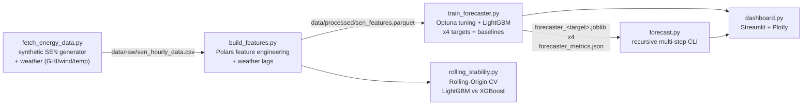

# ⚡ Chile Energy Grid Forecasting

[ 🇺🇸 English ] | [ 🇨🇱 [Español](README.es.md) ]


Hourly multi-target forecasting of Chile's National Electric System (SEN) — solar generation, wind generation, demand, and marginal cost (spot price) — for 5 real 220kV nodes, with LightGBM models tuned via Optuna, validated walk-forward against naive/seasonal baselines, real weather-driven features (solar irradiance, wind speed, temperature) closing the causal gap between weather and renewable output, a Rolling-Origin CV stability comparison against XGBoost, a recursive multi-step-ahead forecasting engine, and a Streamlit monitoring dashboard.

## 1. Business context

Chile's SEN is dominated by renewables in its northern nodes (some of the highest solar irradiance in the world, in the Atacama Desert) and increasingly by wind in the south. This creates a real, well-documented market dynamic: high renewable output at a node pushes its marginal cost toward zero by displacing expensive thermal generation, while a demand spike with low renewable output pushes it sharply upward. Forecasting generation, demand, and price ahead of time — at the node level, not just system-wide — is what lets a generator, a large industrial consumer (mining operations are a major load in the north), or a market operator anticipate cost exposure and price-spike risk instead of reacting to it after the fact. Forecasting all four series (not just price) also matters operationally: a grid operator scheduling reserves cares about *how much* solar/wind/demand to expect, not only what it will cost.

## 1.1 Business Impact & Key Performance Indicators

| Metric | Result | What it means |
|---|---|---|
| Solar generation WAPE | **3.60%** (vs. 26.95% naive, 19.46% seasonal-naive) | Largest LightGBM edge -- strong deterministic diurnal structure persistence can't exploit |
| Demand WAPE | **2.54%** (vs. 4.79% naive) | Nearly half the error of 1-hour persistence |
| Marginal cost WAPE | **5.95%** (vs. 10.26% naive) | Cost-exposure forecasting a generator/large consumer can act on |
| Honest finding: wind | Naive (9.93%) narrowly beats LightGBM (10.31%) | Root-caused, not hidden -- wind generation here is close to a pure mean-reverting random walk, where persistence is close to information-theoretically optimal |
| Cross-model stability (marginal cost) | LightGBM CV 0.051 vs. XGBoost CV 0.133 | ~2.6x more stable across rolling 14-day test folds -- a concrete reason to prefer LightGBM for this target, not just a general preference |

## 2. Data

Chile's grid coordinator (CEN) does not expose a simple, free public API for historical hourly data by node, so this project generates **2 years (2024–2025) of synthetic hourly data** for 5 real SEN nodes/barras, built to reproduce the actual mechanics of the market rather than being random noise:

| Node | Profile | Solar cap. (MWh) | Wind cap. (MWh) | Base demand (MWh) |
|---|---|---|---|---|
| Crucero_220kV | Mining (near-flat, 24/7 load) | 220 | 40 | 180 |
| Cardones_220kV | Mixed | 200 | 60 | 90 |
| Quillota_220kV | Urban (double peak) | 110 | 70 | 140 |
| Alto_Jahuel_220kV | Urban (double peak) | 130 | 30 | 320 |
| Charrua_220kV | Industrial, high wind | 70 | 140 | 150 |

Key modeling choices in the generator (`src/data/fetch_energy_data.py`):
- **Weather comes first, generation is derived from it — not the other way around.** The generator computes physical weather signals (`ghi_w_m2`: global horizontal solar irradiance, W/m²; `wind_speed_ms`; `temperature_c`) per node, each reflecting real Chilean geography (the Atacama Desert nodes get some of the highest clear-sky GHI in the world; southern nodes are cooler and cloudier), and **solar/wind generation are mathematically derived from them** — solar as a linear fraction of clear-sky GHI, wind through a simplified turbine power curve (cut-in/rated wind speed, not an arbitrary exponent) — instead of being computed as a separate, disconnected process.
- **Solar** follows a seasonal daylight window (Southern Hemisphere: longer days in December, shorter in June) and a diurnal bell curve, modulated by a per-day cloudiness factor — all captured in `ghi_w_m2`.
- **Wind** speed is a mean-reverting, autocorrelated random walk with occasional regime shifts ("wind fronts"), not diurnal — matching how wind behaves relative to solar; generation follows a power curve (zero below cut-in, rising with wind speed, flat at rated capacity above it).
- **Demand** uses a profile-specific hourly shape (mining is nearly flat; urban has a clear morning/evening double peak), a weekend/holiday discount (via the `holidays` library's Chilean calendar), a 3%/year growth trend, and a modest HVAC-style temperature effect (extra load outside an 18–24°C comfort band) — deliberately secondary to the hourly/calendar shape, which stays the dominant demand driver, matching how real demand responds to temperature.
- **Marginal cost** is derived from *residual demand* (demand minus solar and wind), following real merit-order logic, plus occasional supply-stress/transmission-constraint price spikes. Near-zero prices during high solar and low residual demand are a real, documented phenomenon in northern Chile — not a generator artifact.

Raw data and processed features are git-ignored and regenerated on demand (see [Getting started](#8-getting-started)).

## 3. Architecture



## 4. Methodology

**Feature engineering** (`src/features/build_features.py`, Polars, computed **per node** via `.over("node")` so panel rows from different barras never leak into each other's windows):
- Lags at 1h, 24h, and 168h (1 week) for solar, wind, demand, and price.
- **Weather lags** at 1h, 3h, 6h, and 24h for `ghi_w_m2` (solar irradiance), `wind_speed_ms`, and `temperature_c` (`add_weather_lag_features`) — shorter horizons than the target lags, because weather autocorrelates and decays faster hour-to-hour than a weekly demand pattern does, so a 168h weather lag would add little. Like the 4 targets, the *raw same-hour* weather value is excluded from the feature set (`get_feature_columns`) — only lags are used, since this project simulates historical observations, not an NWP forecast that would legitimately know future-hour weather in advance.
- Rolling mean/std over 6h and 24h windows — computed on `shift(1)` so the window never includes the row being predicted.
- Cyclical sin/cos encoding of hour-of-day and month, avoiding the artificial 23→0 / Dec→Jan jump of a raw integer.
- Calendar features: day of week, weekend flag, and legal Chilean holidays (including movable holidays like Good Friday, via the `holidays` library).

**Model, tuning & validation** (`src/models/train_forecaster.py`): one `LGBMRegressor` per target — solar, wind, demand, and price all share the exact same feature set (same-hour raw values of all 4 targets, plus the 3 raw weather variables, are always excluded; a real deployment wouldn't know current demand or generation with certainty either, only lags and rolling stats). For each target, **Optuna** (`tune_hyperparameters`) searches learning rate, tree depth/leaves, subsampling, and L1/L2 regularization over 20 trials, minimizing walk-forward WAPE on 3 folds; the best hyperparameters are then re-validated with a full 5-fold walk-forward pass for reporting.

Validation uses `TimeSeriesSplit` applied to **unique timestamps** (`src/models/validation.py`), not raw panel rows — with 5 nodes sharing each hour, splitting on row order alone could put one node's hour *t* in training while another node's hour *t-1* lands in test, which is still lookahead leakage even though the row index is "later." Splitting on the timestamp axis moves every node's data for a given time block together. Baselines (`src/models/baselines.py`) are evaluated on the exact same folds and the exact same WAPE metric, so the LightGBM-vs-baseline comparison below is apples-to-apples.

**Rolling-Origin CV** (`src/models/rolling_stability.py`, `validation.get_rolling_origin_folds`): a second, distinct validation strategy alongside the expanding walk-forward above. Each fold trains on a **fixed-size** rolling window (default 180 days) and tests on the following 14 days, sliding forward — unlike the expanding walk-forward (where each fold's training set keeps growing), every fold here sees the same amount of recent history. That isolates **temporal stability** specifically: if a model's error varies a lot fold-to-fold under a constant training-window size, that is evidence of real instability, not just "the later fold had more data." Used to compare LightGBM against **XGBoost** (previously listed in `requirements.txt` but unused anywhere in the codebase) via each model's coefficient of variation (CV = std/mean) of WAPE across folds — see §5.2.

Error is reported as **WAPE** (Weighted Absolute Percentage Error: `sum(|error|) / sum(|actual|)`) rather than MAPE, because `solar_generation_mwh` is exactly 0 every night, which would make a per-point percentage error undefined at every nighttime hour.

**Multi-step-ahead forecasting** (`src/models/forecast.py`): recursively predicts N hours ahead per node. Because all 4 targets share one feature set built only from lags/rolling stats (never same-hour values), a single feature vector per future hour is enough to predict all 4 at once — there's no need to decide "which target to forecast first." Each predicted hour is fed back into the history buffer before moving to the next, exactly as it would work in production, where the real future doesn't exist yet either.

## 5. Results

### 5.1 Walk-forward validation: LightGBM (Optuna-tuned, weather-augmented) vs. baselines

Walk-forward validation, 5 folds each, 48 shared features (36 before this round + 12 weather lags), LightGBM (Optuna-tuned) vs. two baselines evaluated on identical folds — **naive** (persist the value from 1h ago) and **seasonal naive** (persist the value from the same hour 24h ago). Bold marks the actual best of the three per row — not always LightGBM, on purpose (see the honest finding below):

| Target | LightGBM WAPE | Naive WAPE | Seasonal WAPE | LightGBM MAE |
|---|---|---|---|---|
| Solar generation | **3.60%** | 26.95% | 19.46% | 1.21 MWh |
| Wind generation | 10.31% | **9.93%** | 44.89% | 2.13 MWh |
| Demand | **2.54%** | 4.79% | 5.60% | 4.28 MWh |
| Marginal cost | **5.95%** | 10.26% | 12.08% | $5.27/MWh |

All numbers come directly from running `python -m src.models.train_forecaster` end to end (seed 42, 87,720 rows over 5 nodes × 17,544 hours, 20 Optuna trials/target). LightGBM clearly beats both baselines on solar, demand, and price; solar's WAPE dropped from 4.57% to 3.60% relative to the pre-weather baseline, the single largest gain in this round of work.

**Honest finding, reported as-is rather than tuned away: on wind, naive 1-hour persistence (9.93% WAPE) now narrowly beats LightGBM (10.31%), even with real weather features and Optuna tuning.** This flips the previous README's own stated hypothesis — "a real next step would be adding weather-forecast features [to close wind's narrow LightGBM-vs-naive gap]" — and the controlled ablation in §5.2 shows *why* that hypothesis doesn't hold: `wind_generation_mwh` here is close to a pure mean-reverting random walk (very weak 2%/hour reversion, ~0.99 hour-to-hour autocorrelation in the underlying wind-speed process), a regime where 1-step persistence is close to the information-theoretically best point forecast regardless of what other features are available — a real, well-documented property of short-horizon wind forecasting, not a bug in this pipeline. Solar doesn't have this problem because it has strong deterministic structure (a diurnal/seasonal cycle) that persistence can't exploit but irradiance and calendar features can.

### 5.2 Isolating weather's real effect: a controlled ablation (`notebooks/02_Weather_Augmented_Rolling_CV.ipynb`)

§5.1's improvement (solar 4.57%→3.60%) confounds two changes at once: the new weather features, *and* Optuna re-tuning hyperparameters over the new, larger feature space. The notebook isolates the weather features alone, holding hyperparameters **fixed** across a with/without comparison:

| Target | WAPE without weather | WAPE with weather | Delta |
|---|---|---|---|
| Solar generation | 3.79% | 3.69% | **+0.10 pts** |
| Wind generation | 10.55% | 10.55% | +0.003 pts (none) |
| Demand | 2.55% | 2.55% | −0.01 pts |
| Marginal cost | 6.18% | 6.26% | −0.08 pts |

**The isolated effect is real for solar, essentially zero for wind, and slightly negative for demand/price** — much smaller than §5.1's headline number suggested, and that gap between the two tables *is itself the finding*: a naive before/after comparison that changes features and re-tunes hyperparameters at the same time overstates how much of the credit belongs to the features specifically. Wind shows no measurable benefit because `wind_generation_mwh`'s own lags already encode nearly all the information `wind_speed_ms` lags could add (generation is a near-deterministic function of wind speed here) — the two feature sets are redundant, not complementary. Demand and price got marginally *worse* with more features and no re-tuning — a standard, well-known effect of adding dimensionality without adjusting regularization for it.

### 5.3 Rolling-Origin CV: LightGBM vs. XGBoost temporal stability

8 folds, fixed 180-day training window / 14-day test window, sliding forward (`src/models/rolling_stability.py` — XGBoost, listed in `requirements.txt` since the start of this project but never actually used anywhere until now):

| Target | LightGBM mean WAPE (CV) | XGBoost mean WAPE (CV) |
|---|---|---|
| Solar | 4.10% (0.100) | 4.21% (0.115) |
| Wind | 10.82% (0.142) | 10.99% (0.137) |
| Demand | 2.51% (0.046) | 2.51% (0.040) |
| Marginal cost | **6.87% (0.051)** | 7.89% (0.133) |

CV = coefficient of variation (std/mean) of fold WAPE — lower means more stable across time blocks. Three targets are a wash between the two models, but **on marginal cost, XGBoost's WAPE swings from 6.72% to 9.96% depending which 14-day block it's evaluated on (CV 0.133), while LightGBM stays in a much tighter 6.18%–7.32% band (CV 0.051)** — roughly 2.6x more stable. This is exactly the kind of problem expanding walk-forward CV (§5.1, used for the deployed model) structurally can't surface: with a training set that keeps growing, one bad fold gets diluted into the average instead of standing out. A model that's fine on average but unreliable fold-to-fold is a real production risk that only a fixed-window comparison like this one exposes — a concrete, data-backed reason to prefer LightGBM over XGBoost for the price target specifically, not just a general preference.

The Streamlit dashboard's historical panel shows real vs. forecasted price on the last fold's out-of-sample test set — genuine held-out predictions, not in-sample fit — and a separate live panel runs the actual recursive multi-step forecaster on hours that don't exist in the dataset at all.

## 6. Multi-step forecasting example

```bash
python -m src.models.forecast --horizon 12 --nodes Crucero_220kV
```

Real output (mining-profile node, forecast starting at local midnight): solar output ramps from 0 to 154.7 MWh between 00:00 and 11:00 as the sun rises, and marginal cost falls from $112.39/MWh to $71.04/MWh over the same window as rising solar displaces expensive generation — the merit-order dynamic from the data generator, recovered purely from the model's own recursive predictions, not hardcoded.

**A real limitation the recursive forecaster's own output exposes**: wind generation stays essentially flat (~6.9 MWh) across the whole 12-hour horizon above. That's not a model failure — it's `forecast.py` persisting the last *known* weather values forward into future hours (see `forecast_node`, `last_known_weather`), because this project simulates historical weather observations, not an NWP forecast for future hours. Solar still evolves correctly because its dominant driver (the cyclical hour-of-day/month encoding) is recomputed exactly for each future timestamp regardless of weather persistence, but wind — which depends almost entirely on the persisted weather value — visibly loses its own random-walk dynamics beyond the first step. Documented here rather than hidden: a production deployment would need real NWP wind forecasts for the recursive horizon, not persistence.

## 7. Tech stack

Python · Polars · pandas · NumPy · LightGBM · XGBoost · Optuna · scikit-learn (`TimeSeriesSplit`) · Streamlit · Plotly · `holidays` · Jupyter/matplotlib (notebook) · pytest (30 tests: feature-leakage checks, weather-lag correctness, fold-splitting invariants for both walk-forward and Rolling-Origin CV, baseline correctness, end-to-end recursive-forecast validation, dashboard smoke test via `streamlit.testing.v1.AppTest`)

## 8. Getting started

```bash
python -m venv venv
venv\Scripts\activate          # Windows
pip install -r requirements.txt

python -m src.data.fetch_energy_data      # generate synthetic SEN data (targets + weather)
python -m src.features.build_features     # build lag/rolling/cyclical/weather features
python -m src.models.train_forecaster      # Optuna tuning + walk-forward train/validate, all 4 targets
# optional: --trials N (default 20) --splits N (default 5)

python -m src.models.rolling_stability     # Rolling-Origin CV, LightGBM vs XGBoost, all 4 targets

python -m src.models.forecast --horizon 24 --nodes all   # recursive N-hour-ahead forecast (CLI)
streamlit run src/app/dashboard.py                        # launch the monitoring dashboard

python -m pytest tests/ -v                                 # run the test suite

jupyter nbconvert --to notebook --execute --inplace notebooks/02_Weather_Augmented_Rolling_CV.ipynb
```

## 9. Project structure

```
src/
  data/       fetch_energy_data.py    synthetic SEN hourly data generator + weather (GHI/wind/temp)
  features/   build_features.py       Polars lag/rolling/cyclical/calendar/weather-lag features
  models/     validation.py           walk-forward folds + Rolling-Origin folds + WAPE metric
              baselines.py            naive / seasonal-naive reference metrics
              train_forecaster.py     Optuna tuning + LightGBM, 4 targets
              rolling_stability.py    Rolling-Origin CV, LightGBM vs XGBoost temporal stability
              forecast.py             recursive multi-step-ahead CLI
  app/        dashboard.py            Streamlit monitoring + live-forecast dashboard
notebooks/    02_Weather_Augmented_Rolling_CV.ipynb   weather-feature ablation + stability analysis
tests/                                pytest: features, validation, baselines, forecast, dashboard,
                                       rolling stability, feature-column exclusion
```

## 10. Author

**Pablo Reyes** — [github.com/Rxyxs](https://github.com/Rxyxs)
Code: MIT — see [LICENSE](LICENSE)
