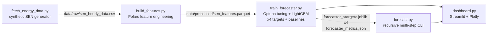

# ⚡ Chile Energy Grid Forecasting

[ 🇺🇸 English ] | [ 🇨🇱 [Español](README.es.md) ]


Hourly multi-target forecasting of Chile's National Electric System (SEN) — solar generation, wind generation, demand, and marginal cost (spot price) — for 5 real 220kV nodes, with LightGBM models tuned via Optuna, validated walk-forward against naive/seasonal baselines, a recursive multi-step-ahead forecasting engine, and a Streamlit monitoring dashboard.

## 1. Business context

Chile's SEN is dominated by renewables in its northern nodes (some of the highest solar irradiance in the world, in the Atacama Desert) and increasingly by wind in the south. This creates a real, well-documented market dynamic: high renewable output at a node pushes its marginal cost toward zero by displacing expensive thermal generation, while a demand spike with low renewable output pushes it sharply upward. Forecasting generation, demand, and price ahead of time — at the node level, not just system-wide — is what lets a generator, a large industrial consumer (mining operations are a major load in the north), or a market operator anticipate cost exposure and price-spike risk instead of reacting to it after the fact. Forecasting all four series (not just price) also matters operationally: a grid operator scheduling reserves cares about *how much* solar/wind/demand to expect, not only what it will cost.

## 2. Data

Chile's grid coordinator (CEN) does not expose a simple, free public API for historical hourly data by node, so this project generates **2 years (2024–2025) of synthetic hourly data** for 5 real SEN nodes/barras, built to reproduce the actual mechanics of the market rather than being random noise:

| Node | Profile | Solar cap. (MWh) | Wind cap. (MWh) | Base demand (MWh) |
|---|---|---|---|---|
| Crucero_220kV | Mining (near-flat, 24/7 load) | 220 | 40 | 180 |
| Cardones_220kV | Mixed | 200 | 60 | 90 |
| Quillota_220kV | Urban (double peak) | 110 | 70 | 140 |
| Alto_Jahuel_220kV | Urban (double peak) | 130 | 30 | 320 |
| Charrua_220kV | Industrial, high wind | 70 | 140 | 150 |

Key modeling choices in the generator (`src/data/fetch_energy_data.py`):
- **Solar** follows a seasonal daylight window (Southern Hemisphere: longer days in December, shorter in June) and a diurnal bell curve, modulated by a per-day cloudiness factor.
- **Wind** is a mean-reverting, autocorrelated random walk with occasional regime shifts ("wind fronts"), not diurnal — matching how wind behaves relative to solar.
- **Demand** uses a profile-specific hourly shape (mining is nearly flat; urban has a clear morning/evening double peak), a weekend/holiday discount (via the `holidays` library's Chilean calendar), and a 3%/year growth trend.
- **Marginal cost** is derived from *residual demand* (demand minus solar and wind), following real merit-order logic, plus occasional supply-stress/transmission-constraint price spikes. Near-zero prices during high solar and low residual demand are a real, documented phenomenon in northern Chile — not a generator artifact.

Raw data and processed features are git-ignored and regenerated on demand (see [Getting started](#8-getting-started)).

## 3. Architecture



## 4. Methodology

**Feature engineering** (`src/features/build_features.py`, Polars, computed **per node** via `.over("node")` so panel rows from different barras never leak into each other's windows):
- Lags at 1h, 24h, and 168h (1 week) for solar, wind, demand, and price.
- Rolling mean/std over 6h and 24h windows — computed on `shift(1)` so the window never includes the row being predicted.
- Cyclical sin/cos encoding of hour-of-day and month, avoiding the artificial 23→0 / Dec→Jan jump of a raw integer.
- Calendar features: day of week, weekend flag, and legal Chilean holidays (including movable holidays like Good Friday, via the `holidays` library).

**Model, tuning & validation** (`src/models/train_forecaster.py`): one `LGBMRegressor` per target — solar, wind, demand, and price all share the exact same feature set (same-hour raw values of all 4 targets are always excluded, see `get_feature_columns`; a real deployment wouldn't know current demand or generation with certainty either, only lags and rolling stats). For each target, **Optuna** (`tune_hyperparameters`) searches learning rate, tree depth/leaves, subsampling, and L1/L2 regularization over 20 trials, minimizing walk-forward WAPE on 3 folds; the best hyperparameters are then re-validated with a full 5-fold walk-forward pass for reporting.

Validation uses `TimeSeriesSplit` applied to **unique timestamps** (`src/models/validation.py`), not raw panel rows — with 5 nodes sharing each hour, splitting on row order alone could put one node's hour *t* in training while another node's hour *t-1* lands in test, which is still lookahead leakage even though the row index is "later." Splitting on the timestamp axis moves every node's data for a given time block together. Baselines (`src/models/baselines.py`) are evaluated on the exact same folds and the exact same WAPE metric, so the LightGBM-vs-baseline comparison below is apples-to-apples.

Error is reported as **WAPE** (Weighted Absolute Percentage Error: `sum(|error|) / sum(|actual|)`) rather than MAPE, because `solar_generation_mwh` is exactly 0 every night, which would make a per-point percentage error undefined at every nighttime hour.

**Multi-step-ahead forecasting** (`src/models/forecast.py`): recursively predicts N hours ahead per node. Because all 4 targets share one feature set built only from lags/rolling stats (never same-hour values), a single feature vector per future hour is enough to predict all 4 at once — there's no need to decide "which target to forecast first." Each predicted hour is fed back into the history buffer before moving to the next, exactly as it would work in production, where the real future doesn't exist yet either.

## 5. Results

Walk-forward validation, 5 folds each, 36 shared features, LightGBM (Optuna-tuned) vs. two baselines evaluated on identical folds — **naive** (persist the value from 1h ago) and **seasonal naive** (persist the value from the same hour 24h ago):

| Target | LightGBM WAPE | Naive WAPE | Seasonal WAPE | LightGBM MAE |
|---|---|---|---|---|
| Solar generation | **4.57%** | 27.02% | 19.68% | 1.22 MWh |
| Wind generation | **10.51%** | 10.76% | 31.56% | 2.23 MWh |
| Demand | **2.44%** | 4.98% | 5.54% | 3.98 MWh |
| Marginal cost | **5.76%** | 9.57% | 10.76% | $5.12/MWh |

All numbers come directly from running `python -m src.models.train_forecaster` end to end (seed 42, 87,720 rows over 5 nodes × 17,544 hours, 20 Optuna trials/target). LightGBM clearly beats both baselines on solar, demand, and price.

**Honest finding kept rather than smoothed over**: on wind, LightGBM (10.51% WAPE) barely beats simple persistence (10.76%) — a ~0.25-point edge, far smaller than on the other three targets. This matches the generator's own design: wind is modeled as a mean-reverting random walk with strong hour-to-hour autocorrelation and no diurnal pattern, so "the wind an hour from now is close to the wind right now" is already close to the best achievable predictor, and there's limited additional signal in calendar/cyclical features for a model to exploit. A real next step (documented, not implemented here) would be adding weather-forecast features (regional pressure gradients, upstream wind observations) rather than expecting more gain from calendar-only features.

The Streamlit dashboard's historical panel shows real vs. forecasted price on the last fold's out-of-sample test set — genuine held-out predictions, not in-sample fit — and a separate live panel runs the actual recursive multi-step forecaster on hours that don't exist in the dataset at all.

## 6. Multi-step forecasting example

```bash
python -m src.models.forecast --horizon 12 --nodes Crucero_220kV
```

Real output (mining-profile node, forecast starting at local midnight): solar output ramps from 0 to 175 MWh between 00:00 and 11:00 as the sun rises, and marginal cost falls from $112/MWh to $51/MWh over the same window as rising solar displaces expensive generation — the merit-order dynamic from the data generator, recovered purely from the model's own recursive predictions, not hardcoded.

## 7. Tech stack

Python · Polars · pandas · NumPy · LightGBM · Optuna · scikit-learn (`TimeSeriesSplit`) · Streamlit · Plotly · `holidays` · pytest (21 tests: feature-leakage checks, fold-splitting invariants, baseline correctness, end-to-end recursive-forecast validation, dashboard smoke test via `streamlit.testing.v1.AppTest`)

## 8. Getting started

```bash
python -m venv venv
venv\Scripts\activate          # Windows
pip install -r requirements.txt

python -m src.data.fetch_energy_data      # generate synthetic SEN data
python -m src.features.build_features     # build lag/rolling/cyclical features
python -m src.models.train_forecaster      # Optuna tuning + walk-forward train/validate, all 4 targets
# optional: --trials N (default 20) --splits N (default 5)

python -m src.models.forecast --horizon 24 --nodes all   # recursive N-hour-ahead forecast (CLI)
streamlit run src/app/dashboard.py                        # launch the monitoring dashboard

python -m pytest tests/ -v                                 # run the test suite
```

## 9. Project structure

```
src/
  data/       fetch_energy_data.py    synthetic SEN hourly data generator
  features/   build_features.py       Polars lag/rolling/cyclical/calendar features
  models/     validation.py           shared walk-forward folds + WAPE metric
              baselines.py            naive / seasonal-naive reference metrics
              train_forecaster.py     Optuna tuning + LightGBM, 4 targets
              forecast.py             recursive multi-step-ahead CLI
  app/        dashboard.py            Streamlit monitoring + live-forecast dashboard
tests/                                pytest: features, validation, baselines, forecast, dashboard
```

## 10. Author

**Pablo Reyes** — [github.com/Rxyxs](https://github.com/Rxyxs)
Code: MIT — see [LICENSE](LICENSE)
